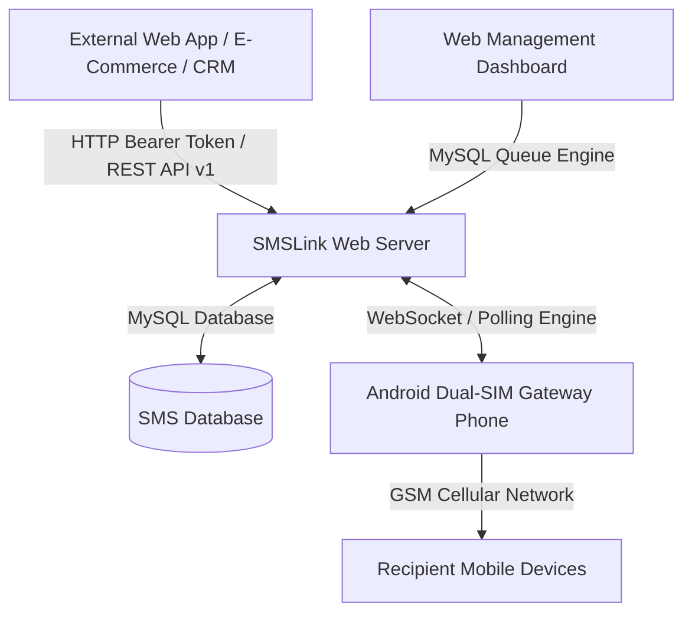

# SMSLink - Turn any Android phone into your SMS gateway

[](https://github.com/beingniloy/smslink/releases)
[](LICENSE)
[](https://php.net)
[](https://mysql.com)

**SMSLink** is a production-ready, open-source telephony gateway solution that transforms Android phones into high-speed, dual-SIM outbound SMS dispatch engines. Built with a lightweight MySQL queue system, real-time web dashboard, interactive API tester console, and RESTful API endpoints.

---

## ✨ Features

- **⚡ Instant QR Code Device Pairing:** Pair Android phones effortlessly using CameraX QR code scanning.
- **📱 Dual-SIM Intelligent Routing:** Route outbound SMS through SIM Slot 1, SIM Slot 2, or automatic failover.
- **🚀 REST API v1 & Webhooks:** Clean JSON REST API supporting Bearer Token, X-API-Key header, and query string authentication.
- **🛠️ Built-in Interactive API Tester Console:** Test REST API endpoints live directly from your web browser (`/api-test.php`).
- **📊 Real-time Dashboard Analytics:** Outbound message volume trends, status ratios (Sent, Queued, Failed), and live event activity logs.
- **🔒 Granular Team & Subaccount Management:** Multi-user support with role-based permissions (Admin vs Member), avatar customization, and password resets.
- **🔄 System Auto-Updater:** Built-in 1-click update checker with automated database schema migration engine.
- **🛡️ Secure & Lightweight:** Built on pure PHP PDO and MySQL with zero heavy dependencies or framework bloat.

---

## 🏗️ Architecture Overview



---

## 🛠️ Requirements

- **PHP:** 7.4 or higher (PHP 8.x recommended)
- **Extensions:** `pdo_mysql`, `json`, `curl`, `mbstring`
- **Database:** MySQL 5.7+ or MariaDB 10.2+
- **Web Server:** Apache (with `mod_rewrite`) or Nginx / Laragon / XAMPP / Cpanel
- **Android Device:** Android 7.0 (API 24) or newer with dual SIM support and camera for QR pairing

---

## 🚀 Installation Guide

### 1. Clone the Repository
```bash
git clone https://github.com/beingniloy/smslink.git
cd smslink
```

### 2. Configure Web Server Document Root
Point your local web server (Laragon, XAMPP, Nginx, or Apache) to the project directory.

### 3. Run Web Installation Wizard
Open your web browser and navigate to:
```
http://your-domain.local/install/
```
Follow the step-by-step web installation wizard to:
1. Verify server environment requirements.
2. Provide MySQL database host, database name, user, and password.
3. Automatically execute database migrations and set up the default Administrator account.

---

## 🔑 REST API Reference

### Base API Endpoint
```
https://your-domain.com/api/v1
```

### Authentication Headers
Include your API secret token in the HTTP Request Header:
```http
Authorization: Bearer YOUR_SECRET_API_KEY
X-API-Key: YOUR_SECRET_API_KEY
```

---

### 📩 1. Dispatch Outbound SMS
**`POST /api/v1/send`**

#### Request Payload (JSON)
```json
{
  "to": "01700000000",
  "message": "Your verification security code is 948201.",
  "sim_slot": 1,
  "device_id": "auto"
}
```

#### Response (200 OK)
```json
{
  "ok": true,
  "msg_id": "msg_66da812f948201",
  "count": 1,
  "device": "dev_s24ultra",
  "sim_slot": 1
}
```

---

### 🔍 2. Check SMS Delivery Status
**`GET /api/v1/status`**

#### Query Parameter
`?msg_id=msg_66da812f948201`

#### Response (200 OK)
```json
{
  "ok": true,
  "message_id": "msg_66da812f948201",
  "status": "delivered",
  "error": null,
  "sent_at": "2026-09-13 11:45:10"
}
```

---

### 📱 3. List Connected Gateway Devices
**`GET /api/v1/devices`**

#### Response (200 OK)
```json
{
  "ok": true,
  "count": 1,
  "devices": [
    {
      "device_id": "dev_s24ultra",
      "device_name": "Galaxy S24 Ultra Gateway",
      "model": "Samsung SM-S928B",
      "android_version": "Android 14",
      "status": "online",
      "sims": [
        { "slot": 1, "carrier": "Grameenphone", "phone_number": "+8801700000000" },
        { "slot": 2, "carrier": "Robi", "phone_number": "+8801800000000" }
      ]
    }
  ]
}
```

---

## 💻 Code Integration Examples

### cURL
```bash
curl -X POST https://your-domain.com/api/v1/send \
  -H "Authorization: Bearer YOUR_SECRET_API_KEY" \
  -H "Content-Type: application/json" \
  -d '{
    "to": "01700000000",
    "message": "Hello World from SMSLink API",
    "sim_slot": 1
  }'
```

### PHP (cURL)
```php
<?php
$apiKey = 'YOUR_SECRET_API_KEY';
$payload = [
    'to' => '01700000000',
    'message' => 'Hello from PHP Application!',
    'sim_slot' => 1
];

$ch = curl_init('https://your-domain.com/api/v1/send');
curl_setopt($ch, CURLOPT_RETURNTRANSFER, true);
curl_setopt($ch, CURLOPT_POST, true);
curl_setopt($ch, CURLOPT_POSTFIELDS, json_encode($payload));
curl_setopt($ch, CURLOPT_HTTPHEADER, [
    'Content-Type: application/json',
    'Authorization: Bearer ' . $apiKey
]);

$response = curl_exec($ch);
curl_close($ch);
echo $response;
```

### Node.js (fetch)
```javascript
const apiKey = 'YOUR_SECRET_API_KEY';

const response = await fetch('https://your-domain.com/api/v1/send', {
  method: 'POST',
  headers: {
    'Content-Type': 'application/json',
    'Authorization': `Bearer ${apiKey}`
  },
  body: JSON.stringify({
    to: '01700000000',
    message: 'Hello from Node.js service!',
    sim_slot: 1
  })
});

const data = await response.json();
console.log(data);
```

---

## 🧩 Ecosystem & Community Contributions

SMSLink features a dedicated [**`ecosystem/`**](ecosystem/) directory for open-source community contributions including CMS plugins, web modules, and software development kits (SDKs):

- 🔌 **WordPress & WooCommerce Plugin:** [`ecosystem/plugins/wordpress/`](ecosystem/plugins/wordpress/)
- 🌐 **WHMCS SMS Gateway Module:** [`ecosystem/plugins/whmcs/`](ecosystem/plugins/whmcs/)
- 🛍️ **Other CMS Extensions (OpenCart, Magento, PrestaShop):** [`ecosystem/plugins/other-cms/`](ecosystem/plugins/other-cms/)
- 📦 **Language & Framework SDKs:**
  - **PHP SDK:** [`ecosystem/sdks/php-sdk/`](ecosystem/sdks/php-sdk/)
  - **Laravel Package & Channel:** [`ecosystem/sdks/laravel-sdk/`](ecosystem/sdks/laravel-sdk/)
  - **Android SDK:** [`ecosystem/sdks/android-sdk/`](ecosystem/sdks/android-sdk/)
  - **Python SDK:** [`ecosystem/sdks/python-sdk/`](ecosystem/sdks/python-sdk/)
  - **Node.js SDK:** [`ecosystem/sdks/nodejs-sdk/`](ecosystem/sdks/nodejs-sdk/)

We welcome pull requests for new plugins, SDKs, and improvements! Please see our [**`CONTRIBUTING.md`**](CONTRIBUTING.md) guide for details on how to contribute.

---

## 🛡️ Security Best Practices

1. **Keep Configuration Files Private:** `config/db_credentials.php` and `config/installed.lock` are automatically gitignored. Ensure web server root blocks direct access to `config/`.
2. **HTTPS Encryption:** Always host SMSLink behind an SSL/TLS certificate (`https://`) in production environments.
3. **API Secret Key Management:** Generate dedicated API tokens from the Web Dashboard (`/dashboard/#apikeys`) and never expose master secret keys in client-side code.

---

## 📄 License

SMSLink is open-sourced software licensed under the [MIT License](LICENSE).

---

## 👨‍💻 Developer & Maintainer

- **Developer:** Niloy
- **Email:** [hello@niloy.io](mailto:hello@niloy.io)
- **Portfolio:** [https://niloy.io](https://niloy.io)
- **Repository:** [https://github.com/beingniloy/smslink](https://github.com/beingniloy/smslink)
- **Sponsor Project:** [https://niloy.io/sponsor](https://niloy.io/sponsor)
